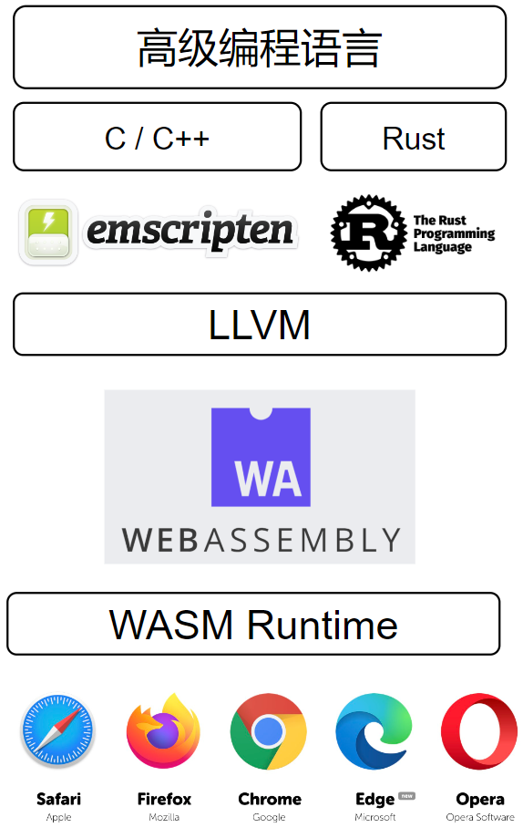

# Rust & WebAssembly

- [Rust \& WebAssembly](#rust--webassembly)
  - [项目介绍](#项目介绍)
    - [项目启动](#项目启动)
      - [构建Rust项目](#构建rust项目)
      - [web端启动](#web端启动)
  - [Wasm](#wasm)
    - [WASM Runtime](#wasm-runtime)
  - [编译 Rust 为 WebAssembly](#编译-rust-为-webassembly)
    - [安装 Rust 环境](#安装-rust-环境)
    - [创建一个新的 Rust 包](#创建一个新的-rust-包)
    - [使用 wasm-bindgen 在 Rust 与 JavaScript 之间通信](#使用-wasm-bindgen-在-rust-与-javascript-之间通信)
    - [在 Rust 中调用来自 JavaScript 的外部函数](#在-rust-中调用来自-javascript-的外部函数)
    - [配置 Cargo.toml](#配置-cargotoml)
    - [构建包](#构建包)
  - [缩小 .wasm 大小](#缩小-wasm-大小)

## 项目介绍

用Rust处理图片，交换R/G/B 颜色通道改变颜色，修改R/G/B 透明度达到滤镜效果，利用wasm-pack将Rust 编译成WebAssembly。参考资料：https://github.com/silvia-odwyer/photon.


### 项目启动

#### 构建Rust项目

用wasm-pack，是根据以下构建步骤:

- Rust 1.30 或打上版本，通过rustup安装wasm32-unknown-unknown目标(target),
- 用cargo将 Rust 的源代码编译为 WebAssembly 的 .wasm二进制文件,
- 为 Rust 生成的 WebAssembly 使用wasm-bindgen，生成 JavaScript API.
  
wasm-pack 构建 rust 生成的 WebAssembly 包

```bash
curl https://rustwasm.github.io/wasm-pack/installer/init.sh -sSf | sh
```

要完成所有这些操作，请在项目目录中，运行此命令:

```bash
cd crate
wasm-pack build
```

构建完成后，我们可以在 pkg 目录中找到它的工件，它应该包含以下内容：

```bash
├── README.md
├── package.json
├── wasm_rust_demo_rs.d.ts
├── wasm_rust_demo_rs.js
├── wasm_rust_demo_rs_bg.js
├── wasm_rust_demo_rs_bg.wasm
└── wasm_rust_demo_rs_bg.wasm.d.ts
```

#### web端启动

```bash
cd www
npm install
npm start
```

## Wasm

WebAssembly 是一门低级的类汇编语言。它有一种紧凑的二进制格式，使其能够以接近原生性能的速度运行，并且为诸如 C++ 和 Rust 等拥有低级的内存模型语言提供了一个编译目标以便它们能够在网络上运行。

### WASM Runtime

WASM 在浏览器里面运行的架构



## 编译 Rust 为 WebAssembly

将编译 Rust 项目为 wasm 并在一个 web 应用中使用它。

### 安装 Rust 环境

> 安装 Rust

文档：https://www.rust-lang.org/tools/install

```bash
curl --proto '=https' --tlsv1.2 -sSf https://sh.rustup.rs | sh
```

> wasm-pack

把rust代码编译成 WebAssembly 并制造出正确的 npm 包。

```bash
cargo install wasm-pack
```

### 创建一个新的 Rust 包

```bash
cargo new --lib hello-wasm
```

项目结构

```text
.
├── Cargo.toml
└── src
    └── lib.rs
```

### 使用 wasm-bindgen 在 Rust 与 JavaScript 之间通信

wasm-pack 使用另一个工具 wasm-bindgen 来提供 JavaScript 和 Rust 类型之间的桥梁。它允许 JavaScript 使用字符串调用 Rust API，或调用 Rust 函数来捕获 JavaScript 异常。

```rust
extern crate wasm_bindgen;

use wasm_bindgen::prelude::*;
```

### 在 Rust 中调用来自 JavaScript 的外部函数

```rust
#[wasm_bindgen]
extern {
    pub fn alert(s: &str);
}
```

### 配置 Cargo.toml

添加底下的部分

```toml
[dependencies]
wasm-bindgen = "0.2"

[lib]
crate-type = ["cdylib"]
```

> [lib] — 告诉 Rust 为我们的包建立一个 cdylib 版本, --crate-type=cdylib 或 #[crate_type = "cdylib"] - 将生成一个动态系统库。如果编译输出的动态库要被另一种语言加载使用，请使用这种编译选项。详细配置项，见：https://www.rustwiki.org.cn/zh-CN/reference/linkage.html#%E9%93%BE%E6%8E%A5。

> [dependencies] - 告诉 Cargo 需要依赖哪个版本的 wasm-bindgen。  

### 构建包

```bash
wasm-pack build
```

wasm-pack build 将做以下几件事：

- 将你的 Rust 代码编译成 WebAssembly。
- 在编译好的 WebAssembly 代码基础上运行 wasm-bindgen，生成一个 JavaScript 文件将 WebAssembly 文件包装成一个模块以便 npm 能够识别它。
- 创建一个 pkg 文件夹并将 JavaScript 文件和生成的 WebAssembly 代码移到其中。
- 读取你的 Cargo.toml 并生成相应的 package.json。
- 复制你的 README.md (如果有的话) 到文件夹中。

```text
.
├── README.md
├── hello_wasm.d.ts
├── hello_wasm.js
├── hello_wasm_bg.js
├── hello_wasm_bg.wasm
├── hello_wasm_bg.wasm.d.ts
└── package.json
```

## 缩小 .wasm 大小

参考：https://rustwasm.github.io/book/game-of-life/code-size.html#shrinking-wasm-size


参考资料：  
Compiling from Rust to WebAssembly: https://developer.mozilla.org/en-US/docs/WebAssembly/Rust_to_wasm  
Rust and WebAssembly: https://llever.com/rustwasm-book/introduction.zh.html  
wasm-bindgen: https://rustwasm.wasmdev.cn/docs/wasm-bindgen/introduction.html
